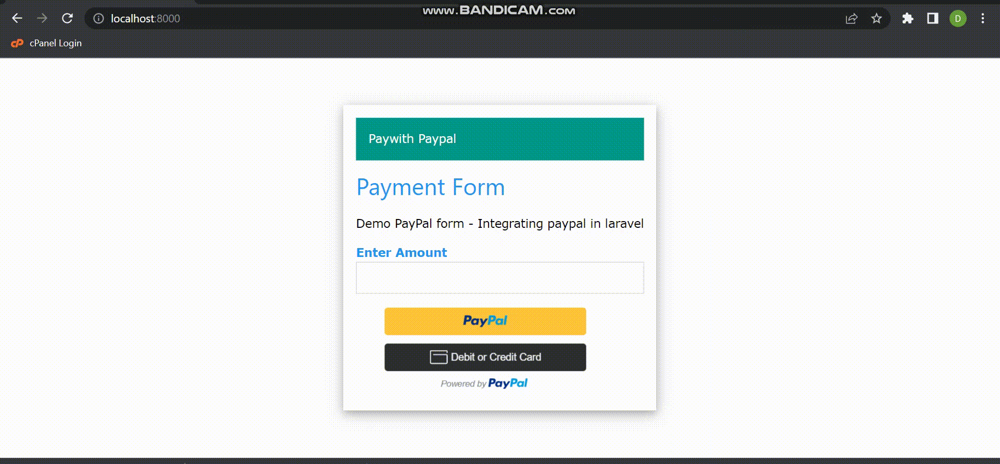

# PaypalIntegration
using PHP Larvel with paypalRestApi and standalone PaypalButton

In this blog, we have walkthrough the paypal smart button with server side php laravel integration which  help us to track the payments even after some mishappenings in the user’s payment journey.

setup steps :
1.Download and install Xampp from this site https://www.apachefriends.org/index.html.
2.Click Start button corresponding to Apache and MySQL.
3.phpMyAdmin  runs on a PHP environment. To use  phpMyAdmin  to manage databases, Apache Web server must be started.
4.visit https://getcomposer.org then download and run Composer-Setup.exe. After you have installed PHP and Composer, you may create a new Laravel project via the Composer . 
5.After installing PHP and Composer,  one can  create a new Laravel project via the Composer.

startup steps:
1.TO run the project,open command prompt and move into the project file using cd command.
2.Type "php artisan serve"...which makes project running on local host:8000
3.open chrome(default browser) and type "localhost:8000" and find project is running there.
4.To check for logs =>open phpproject=>storage=>logs=>laravel(text file)=>there we can check for logs

Demo Snap:
here is the demo of paying money through paypal and getting response..

